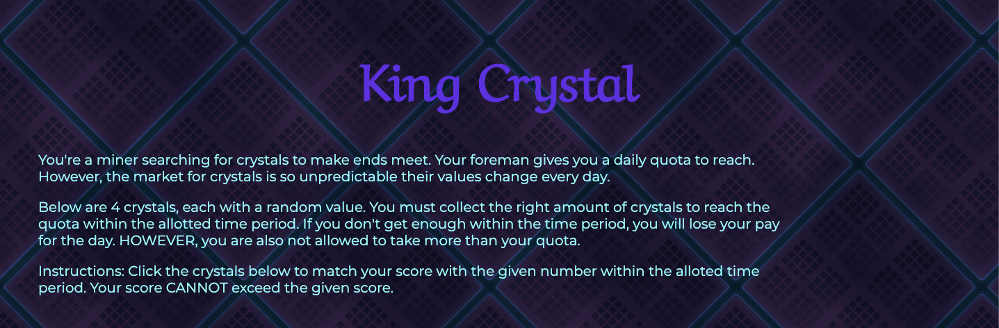
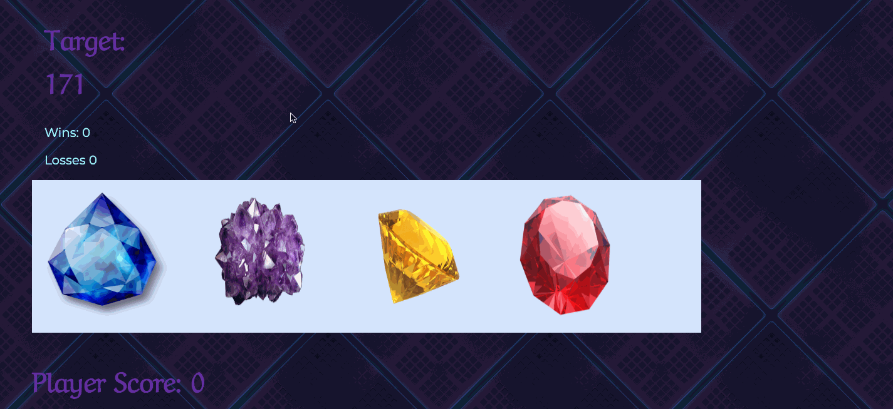

# King Crystal

A number guessing game that creates a random number the player must reach by selecting crystals of randomly generated values.

## Technologies

- HTML
- CSS
- Javascript
- jQuery

## Demo
The player is presented with instructions on how to play the game when they open the website.

Then the player must click on each crystal until they reach the required number. If they go over that number, they will lose and must start over again until they win.

